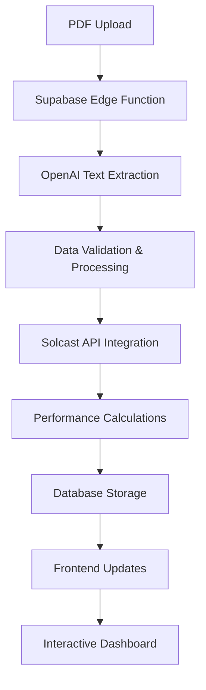

# SolarSage - AI-Powered Solar Performance Analysis Platform

SolarSage is a comprehensive web application that analyzes electricity bills using AI to provide insights into energy usage, solar performance, and cost optimization. The platform features OTP-based authentication, guest mode, and advanced solar performance comparison capabilities.

## 🌟 Features

### Core Functionality
- **AI-Powered Bill Analysis**: Upload PDF electricity bills for automatic data extraction and analysis
- **Solar Performance Analytics**: Compare actual vs expected solar generation with Solcast API integration
- **Neighborhood Rankings**: Compare your solar performance with nearby systems
- **Guest Mode**: Try up to 3 bill analyses without registration
- **OTP Authentication**: Secure email verification system
- **Interactive Dashboard**: Comprehensive insights with WCAG AA compliant design

### Key Metrics & Calculations
- **Solar Generation per Day**: `Total Solar Generation (kWh) / No. of Billing Days`
- **Performance Score**: `(Actual Generation / Expected Generation) × 100`
- **Efficiency Rating**: Based on weather data and system capacity
- **Missed Generation**: `Expected Generation - Actual Generation`
- **Loss Percentage**: `(Missed Generation / Expected Generation) × 100`

## 🏗️ Architecture

### Tech Stack
- **Frontend**: React 18, TypeScript, Tailwind CSS
- **Backend**: Supabase (PostgreSQL, Authentication, Edge Functions)
- **AI**: OpenAI GPT-4 for bill text extraction and analysis
- **Solar Data**: Solcast API for irradiance and generation forecasts
- **PDF Processing**: jsPDF for report generation
- **Charts**: Recharts for data visualization

### Backend ↔ Frontend Flow



## 📁 Project Structure

```
src/
├── components/           # Reusable UI components
│   ├── ui/              # Shadcn UI components
│   ├── OTPVerification.tsx
│   ├── SolarComparator.tsx
│   ├── ImprovedInsightsPanel.tsx
│   └── ...
├── pages/               # Main application pages
│   ├── Index.tsx        # Dashboard
│   ├── Auth.tsx         # Authentication
│   ├── Records.tsx      # Historical data
│   └── GuestLanding.tsx # Guest entry point
├── services/            # API integration services
│   ├── supabaseService.ts
│   ├── guestService.ts
│   └── customerService.ts
├── utils/               # Utility functions
│   ├── insightsGenerator.ts
│   ├── pdfGenerator.ts
│   ├── solcastApi.ts
│   └── pdfUtils.ts
├── contexts/            # React contexts
│   └── AuthContext.tsx
└── integrations/        # External service integrations
    └── supabase/
```

## 🔧 API Endpoints

### Supabase Edge Functions

#### `/functions/process-pdf`
- **Method**: POST
- **Purpose**: Process uploaded PDF and extract bill data
- **Request**:
  ```json
  {
    "pdfText": "string",
    "fileName": "string"
  }
  ```
- **Response**:
  ```json
  {
    "success": true,
    "billData": { /* BillData object */ },
    "insights": { /* InsightsData object */ },
    "dbRecord": { /* Database record */ }
  }
  ```
- **Error Handling**: Returns structured error messages with HTTP status codes

#### `/functions/upload-pdf`
- **Method**: POST
- **Purpose**: Upload and extract text from PDF files
- **Request**: FormData with PDF file
- **Response**:
  ```json
  {
    "success": true,
    "extractedText": "string",
    "fileName": "string"
  }
  ```

### Database Tables

#### `customer_info`
- Stores processed bill data and analysis results
- Row-Level Security (RLS) enabled
- User-specific data isolation

#### `profiles`
- User profile information
- Linked to Supabase Auth users

## 🎨 UI/UX Design Guidelines

### Color Palette
- **Primary**: HSL-based semantic tokens from `index.css`
- **Success/Solar**: Green variants (`green-50` to `green-950`)
- **Warning**: Amber variants (`amber-50` to `amber-950`)
- **Error**: Red variants (`red-50` to `red-950`)
- **Info**: Blue variants (`blue-50` to `blue-950`)

### Accessibility Standards
- **WCAG AA Compliance**: Minimum 4.5:1 contrast ratio
- **Semantic HTML**: Proper heading hierarchy and ARIA labels
- **Keyboard Navigation**: Full keyboard accessibility
- **Screen Readers**: Descriptive text and labels

### Component Guidelines

#### Cards
```tsx
<Card className="border-2 border-primary/20 bg-gradient-to-br from-primary/5 to-primary/10">
  <CardContent className="p-6">
    {/* Content */}
  </CardContent>
</Card>
```

#### Insights Display
- Color-coded by type (info/warning/tip)
- Consistent iconography (Lucide React)
- Progress bars for performance metrics
- Badge system for quick status identification

## ☀️ Solcast API Integration

### Endpoints Used
- **PV Power Estimated Actuals**: Historical generation data
- **PV Power Forecasts**: Expected generation predictions

### Parameters
- `latitude` & `longitude`: Location coordinates
- `capacity`: System capacity in kW
- `start` & `end`: Date range for data retrieval
- `format`: JSON response format

### Sample Response
```json
{
  "estimated_actuals": [
    {
      "period_end": "2024-01-01T01:00:00.000Z",
      "period": "PT30M",
      "pv_estimate": 0.1234
    }
  ],
  "forecasts": [
    {
      "period_end": "2024-01-01T01:00:00.000Z",
      "period": "PT30M", 
      "pv_estimate": 0.1456
    }
  ]
}
```

### Performance Factor
- Default: 0.75-0.85 (75-85% efficiency)
- Accounts for real-world conditions (dust, shading, inverter losses)

## 🏆 Comparator Logic & Ranking

### Scoring Methodology

1. **Data Collection**
   - Extract actual generation from user bills
   - Fetch expected generation from Solcast API
   - Account for system size and location

2. **Score Calculation**
   ```typescript
   const score = (actualGeneration / expectedGeneration) * 100;
   ```

3. **Ranking Algorithm**
   - Sort users by performance score (descending)
   - Group by geographical proximity
   - Filter by system size categories

4. **Performance Tiers**
   - **Excellent**: 90%+ efficiency (Green)
   - **Good**: 75-89% efficiency (Yellow) 
   - **Needs Improvement**: <75% efficiency (Red)

### Neighborhood Comparison
- **Radius**: 5km geographical proximity
- **System Size**: ±2kW capacity tolerance
- **Anonymization**: User privacy protection
- **Historical Trends**: 6-month rolling averages

## 🚀 Deployment Instructions

### Prerequisites
- Node.js 18+ and npm/bun
- Supabase account and project
- OpenAI API key
- Solcast API key (optional)
- Resend account for emails (optional)

### Environment Setup

1. **Supabase Configuration**
   ```bash
   # Required secrets in Supabase Edge Function Secrets:
   OPENAI_API_KEY=your_openai_key
   SUPABASE_URL=your_supabase_url
   SUPABASE_SERVICE_ROLE_KEY=your_service_role_key
   RESEND_API_KEY=your_resend_key (optional)
   ```

2. **Database Setup**
   - Run SQL migrations from `supabase/migrations/`
   - Enable Row Level Security (RLS)
   - Configure authentication providers

### Production Deployment

1. **Frontend (Lovable/Vercel)**
   ```bash
   npm run build
   npm run preview
   ```

2. **Supabase Functions**
   ```bash
   supabase functions deploy process-pdf
   supabase functions deploy upload-pdf
   ```

3. **Domain Configuration**
   - Set custom domain in deployment platform
   - Update Supabase Auth redirect URLs
   - Configure CORS policies

### Security Considerations
- **API Keys**: Store in Supabase Edge Function Secrets
- **RLS Policies**: Enforce user data isolation
- **CORS**: Restrict to production domains
- **Rate Limiting**: Implement for API endpoints
- **Input Validation**: Sanitize all user inputs

## 🧪 Testing

### Local Development
```bash
# Install dependencies
npm install

# Start development server
npm run dev

# Run Supabase locally
supabase start
supabase functions serve
```

### Testing Authentication
1. Create test account with OTP verification
2. Test guest mode (3 PDF limit)
3. Verify Google OAuth integration
4. Test session persistence

### Testing PDF Processing
1. Upload various electricity bill formats
2. Verify data extraction accuracy
3. Test error handling for invalid PDFs
4. Validate solar performance calculations

## 📊 Monitoring & Analytics

### Performance Metrics
- PDF processing success rate
- AI extraction accuracy
- User engagement metrics
- Solar performance analysis quality

### Error Tracking
- Supabase Edge Function logs
- Frontend error boundaries
- API response monitoring
- User feedback collection

## 🔮 Future Enhancements

- **Mobile App**: React Native implementation
- **Advanced ML**: Custom models for bill processing
- **Energy Marketplace**: Solar equipment recommendations
- **Smart Grid Integration**: Real-time energy trading
- **Carbon Footprint**: Environmental impact tracking

## 📄 License

MIT License - See LICENSE file for details

## 🤝 Contributing

1. Fork the repository
2. Create feature branch
3. Follow coding standards
4. Add tests for new features
5. Submit pull request

---

**SolarSage** - Empowering homeowners with intelligent solar insights.
