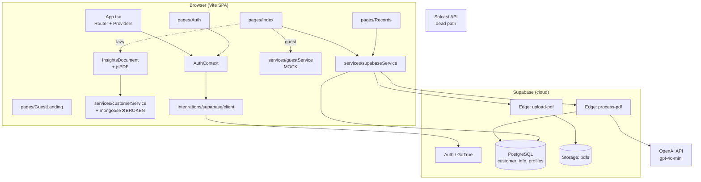
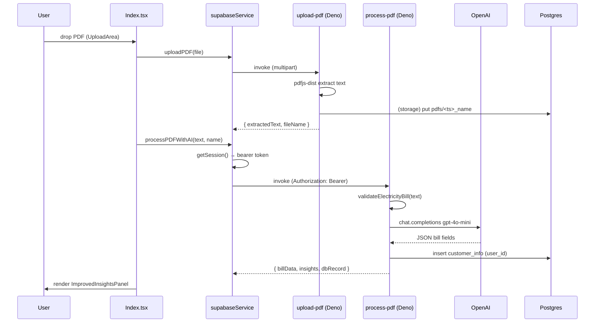
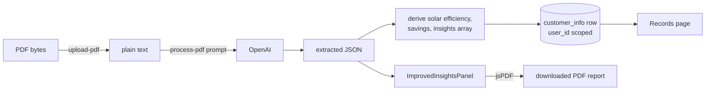
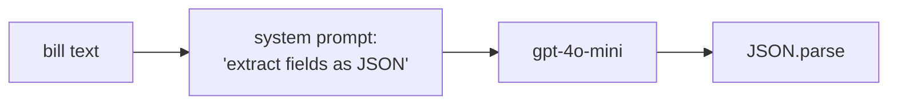
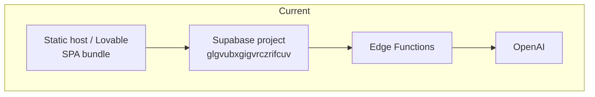

# System Architecture (Reverse-Engineered)

> All diagrams are Mermaid and reflect the **as-built** system, not the aspirational `project_overview.md`.

## 1. Component architecture



## 2. Request flow — authenticated bill analysis (the real path)



## 3. Authentication flow

```mermaid
graph TD
  START[/ visited] --> PR{ProtectedRoute<br/>loading?}
  PR -->|loading| SPIN[spinner]
  PR -->|user or guest| ALLOW[render page]
  PR -->|neither| REDIR[Navigate to /guest]

  subgraph SignIn
    A[Auth.tsx] -->|email/pw| SP[supabase.auth.signInWithPassword]
    A -->|google| OAUTH[signInWithOAuth google]
    SP --> LISTENER[onAuthStateChange]
    OAUTH -->|redirect /| LISTENER
    LISTENER --> CTX[AuthContext sets user/session]
  end

  subgraph Guest
    G[GuestLanding] --> EG[enterGuestMode]
    EG --> LS[localStorage guest_mode=true]
    LS --> CTX
  end

  CTX --> ALLOW
```

Notes:
- Guest mode is **client-only trust** — `localStorage.guest_mode` and `guest_pdf_count`. A user can reset the counter from devtools; the 3-PDF limit is not enforced server-side (and guests never hit the server anyway — they get mock data).
- Profile rows are created by a Postgres trigger (`handle_new_user`) on `auth.users` insert.

## 4. Data flow



## 5. "RAG pipeline" — does not exist

The task brief assumed a FAISS/embedding/retrieval pipeline. **It is not present.** The closest analog is a single zero-shot extraction prompt:



There is no chunking, no embedding, no vector store, no retriever, no re-ranking. If a true RAG capability is desired it must be built from scratch (recommendation in [SOLARSAGE_MASTER_REPORT.md](../SOLARSAGE_MASTER_REPORT.md)).

## 6. Deployment architecture (current + target)



- **Frontend** is a static bundle (`vite build` → `dist/`) — deploy to any static host/CDN (Netlify, Vercel, S3+CloudFront, Nginx).
- **Backend** is fully managed by Supabase; edge functions deploy via `supabase functions deploy`.
- **Secrets** (`OPENAI_API_KEY`, `SUPABASE_SERVICE_ROLE_KEY`) live in Supabase function config, not in the SPA. The SPA only ships the public anon key.

See deployment options in [docs/deployment/](../deployment/).
